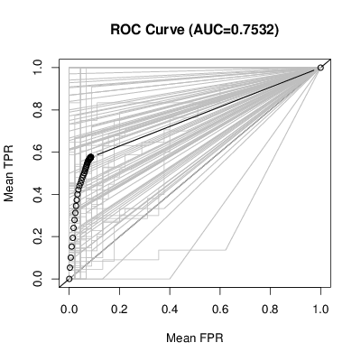
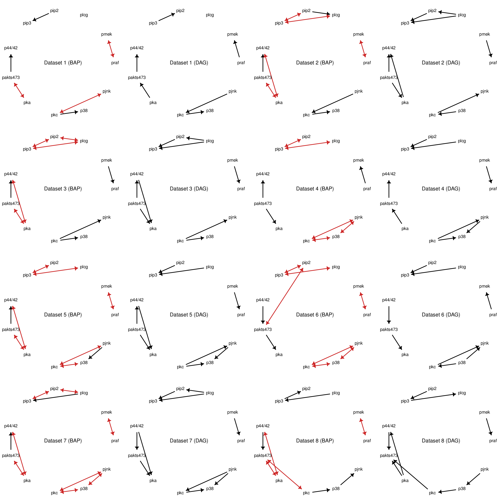

# greedyBAPs

The `greedyBAPs` package contains code to do structure learning in a specific family of graphical models (bow-free acyclic path diagrams or BAPs) via a greedy algorithm. Simply put, it tries to find the best-fitting BAP given some data. For more information about BAPs and some applications of this package, see the paper at https://arxiv.org/abs/1508.01717.

## Installing

You can install this package directly from github using the `devtools` package:
```
devtools::install_github("cnowzohour/greedyBAPs")
```

## Using

For an introduction of how to use this package have a look at the [package vignette](vignettes/greedyBAPs.Rmd) (view in RStudio for best experience).

## Figures from the paper

The paper referenced above contains two figures created using this package:

* Causal effects simulation (created using [inst/generateFigure_simulation.R](inst/generateFigure_simulation.R))

* BAPs vs DAGs on genomic data (created using [inst/generateFigure_genomic.R](inst/generateFigure_genomic.R))

